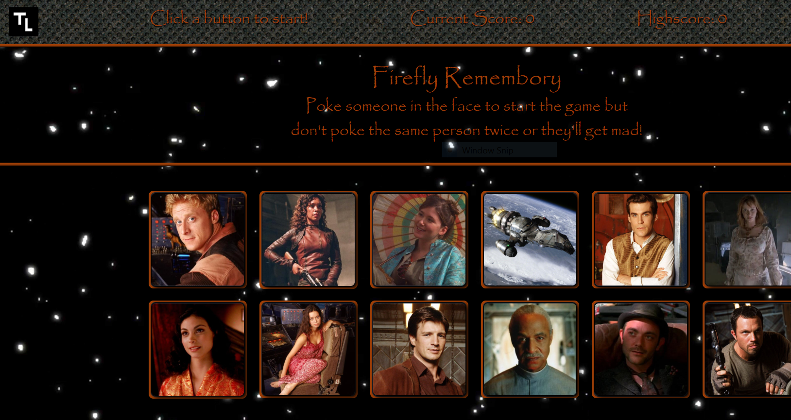

# Firefly Remembory
[Try it for yourself!](https://stormy-journey-52921.herokuapp.com/ "Firefly Remebory")

<kbd></kbd>

## `Firefly Remembory is a memory game built with React`

## `How to play Firefly Remembory`
#### It presents you with twelve buttons and requires that you begin to press the buttons in sequence.  However, the sequence is decided by you!  I know right, mind blown!  How does a computer read your mind and predict the sequence?  (I hear you ask)  Well, I'll tell you.  It doesn't...but it doesn remember which buttons you have pressed in the past and if you press the same on twice you are penalized by being forced to restart the game.  In other words, press every button without duplicating any to win.  

#### If you don't believe me perhaps you would like to [test it for yourself!](https://stormy-journey-52921.herokuapp.com/ "Firefly Remembory")

 

## `Getting started on your machine`: 
* Clone the repo to your local machine
* Install the yarn packages as instructed below
* Run "yarn start" in a terminal window while cd-ed into the game's directory
* React will open a web browser and navigate to localhost:3000 for you

## `Prerequisites`:
* Command Line interface
* Yarn
* Web Browser

### `Required packages` (These are noted in the package.json)
#### Just run the command "yarn install" from a terminal window while inside the same directory as the application to install all dependant packages
* Axios
* React
* React-DOM
* React-Scripts

## `Built With`: 
* VS Code
* HTML5
* CSS3
* Bootstrap
* JavaScript
* NodeJS
* Axios
* Heroku

## `Author`: 
#### Tim Lewis

## `License`
#### ISC

## `Acknowledgments`
* DU's Full Stack Development Bootcamp 
* BFG for helping me when I got stuck

  

## `React Information`

This project was bootstrapped with [Create React App](https://github.com/facebook/create-react-app).

## `Available Scripts`

In the project directory, you can run:

### `npm start`

Runs the app in the development mode. 
Open [http://localhost:3000](http://localhost:3000) to view it in the browser.

The page will reload if you make edits. 
You will also see any lint errors in the console.

### `npm test`

Launches the test runner in the interactive watch mode. 
See the section about [running tests](https://facebook.github.io/create-react-app/docs/running-tests) for more information.

### `npm run build`

Builds the app for production to the `build` folder. 
It correctly bundles React in production mode and optimizes the build for the best performance.

The build is minified and the filenames include the hashes. 
Your app is ready to be deployed!

See the section about [deployment](https://facebook.github.io/create-react-app/docs/deployment) for more information.

### `npm run eject`

**Note: this is a one-way operation. Once you `eject`, you can’t go back!**

If you aren’t satisfied with the build tool and configuration choices, you can `eject` at any time. This command will remove the single build dependency from your project.

Instead, it will copy all the configuration files and the transitive dependencies (Webpack, Babel, ESLint, etc) right into your project so you have full control over them. All of the commands except `eject` will still work, but they will point to the copied scripts so you can tweak them. At this point you’re on your own.

You don’t have to ever use `eject`. The curated feature set is suitable for small and middle deployments, and you shouldn’t feel obligated to use this feature. However we understand that this tool wouldn’t be useful if you couldn’t customize it when you are ready for it.

## Learn More

You can learn more in the [Create React App documentation](https://facebook.github.io/create-react-app/docs/getting-started).

To learn React, check out the [React documentation](https://reactjs.org/).
